[TOC]
#2.0
## 一、主要信息

| 项目 | 内容 |
| --- | --- |
| 作品名称 | Paper Acc——大学生科研一站式平台 |
|  |  |
|  |  |
| Demo 链接 | https://paperacc.top |

## 二、用户洞察与问题定义

### 2.1 作品背景

2025 年，我们自己在参加做科研、发论文、组会汇报时，花了很长时间去找文献、画论文里的 Fig. 1 模型结构图、画汇报海报图、做组会 PPT。神经网络层的堆叠方式改了 13 版，PPT 一遍遍推倒重来……

更关键的是，很多会议和期刊对论文是否具有创新性决定是否录用把控甚严。一个好的 idea、一个好的模型结构图，往往决定了在评委心中对是否为优秀论文并给予 Accept 的第一印象。论文能否发表，也决定着很多研究生是否能顺利毕业。

组会要做论文汇报，很多时候要找一篇研究方向高度相关的文献，找到后需要去阅读论文、复现代码、把握思想，完成汇报 PPT。

我们当时就想：如果有一个工具，能让做科研的广大本科生、研究生、博士生只需要上传自己要发表的论文或者是要汇报的论文，然后说清楚自己的论文想法，就能直接生成专业论文级别的科研绘图、PPT组会汇报，那该多好。

后来我们就真的做了。**Paper Acc** 是我们倾尽心血为所有科研人打磨出来的答案。不是通用 AI 工具的简单包装，而是真正为大学生科研场景深度定制的创作平台。

**让每个科研人都能创作出好看的科研绘图、做出好看的组会 PPT、提高科研效率**，便是我们作品的初衷。

### 2.2 目标用户

Paper Acc 面向有科研表达需求的人群，核心用户包括本科生、研究生、博士生、青年教师，以及需要快速完成论文配图、组会汇报、开题答辩材料的科研从业者。这类用户通常已经具备较强的专业研究能力，能够完成论文阅读、实验设计和结果分析，但他们未必具备同样成熟的视觉表达能力、学术图表绘制能力和汇报材料包装能力。也正因此，他们往往在研究本身完成之后，仍要花费大量时间处理“如何把内容讲清楚、画出来、展示好”的问题，而这正是 Paper Acc 试图解决的核心场景。

### 2.3 用户痛点

1. **论文已经写完，但关键图始终难产。** 很多科研用户在完成实验和论文撰写之后，仍然卡在总体框架图、模型结构图或技术路线图的绘制环节。问题并不在于他们不理解自己的工作，而在于他们很难把复杂的方法流程、模块关系和输入输出逻辑，用简洁、规范、学术化的图表形式表达出来，最终导致论文定稿、开题汇报或答辩准备被严重拖慢。

2. **汇报时间紧，PPT 制作重复而低效。** 在组会、答辩、课程展示等场景中，用户往往需要在很短时间内把一篇论文整理成可讲述、可展示、可下载的 PPT 初稿。这个过程中不仅要梳理目录结构、提炼重点内容，还要处理每一页的逻辑顺序、语言压缩和版式安排。对科研用户来说，这类工作虽然重要，却高度重复，且会占用本该投入在思考与研究上的时间。

3. **通用 AI 工具很强，但不够懂科研表达。** 现有通用型 AI 工具往往更擅长开放式对话和泛化内容生成，但在科研图表场景下，经常出现“能生成，但不够像论文图”的问题。比如结构图中模块命名不规范、流程关系不严谨、视觉表达偏海报风而非学术风，或者生成结果与论文真实内容脱节。对于科研用户而言，他们需要的不是“好看但泛化”的图，而是“可直接用于学术表达”的图。

4. **专业设计软件门槛高，手工制作成本大。** 无论是用 PPT、Visio、Figma、Photoshop，还是其他设计软件手工绘制科研图表，用户都需要投入额外的学习成本与时间成本。对于没有系统设计训练的学生而言，真正困难的不是点击工具本身，而是如何决定信息层级、图形结构、配色规范与排版关系。因此，很多用户会反复修改十几版图和 PPT，精力消耗大，且结果未必理想。

5. **生成结果如果不能继续编辑，就很难真正落地。** 科研用户通常不会满足于“一次性出图”，他们还需要在导师修改意见、组会反馈或投稿要求下继续调整内容。如果生成结果只是图片预览，而不能进一步下载、复用、编辑或留存，那么工具的实际使用价值会大打折扣。因此，科研场景特别强调产物的可编辑性、可导出性和可持续复用能力。

### 2.4 使用场景

1. **组会汇报前的快速准备场景。** 学生在组会或答辩前上传一篇待讲解的论文，系统自动提取核心内容，快速生成技术路线图与汇报 PPT 初稿。这样一来，用户不需要再从零开始整理目录与讲述逻辑，而是可以在现有初稿基础上快速补充实验细节和个人理解，大幅缩短从“读完论文”到“完成汇报”的准备周期。

2. **论文写作后期的科研配图场景。** 在论文接近定稿时，研究者通常已经完成方法设计与实验验证，但往往仍缺少一张能够放在论文前部、概括整体方法的 Fig.1 式流程图。此时用户只需上传论文内容，系统就可以围绕研究问题、核心模块和输入输出关系生成总体框架图，帮助用户补齐论文中的关键视觉表达。

3. **科研宣传与展示物料生成场景。** 在课程展示、竞赛路演、学术海报、实验室宣传等场合，用户不仅需要论文结构图，还需要更具视觉表现力的配图素材。Paper Acc 允许用户直接输入提示词或上传参考图，快速生成适合科研展示的视觉资源，使其既可以服务于学术表达，也能够兼顾外部展示与传播需求。

## 三、产品方案设计

### 3.1 产品概述

Paper Acc 是一个聚焦“科研配图 + 论文汇报生成”的 AI 原生工作台，帮助用户把论文内容或创意描述，快速转化为科研图片、总体框架图、技术路线图和汇报 PPT。它并不试图成为一个泛化的万能 AI 工具，而是围绕科研用户最耗时、最重复、最影响交付效率的表达环节进行优化。换句话说，Paper Acc 的价值不在于替代研究本身，而在于把研究成果更快、更清楚、更专业地转化为可以展示和传播的作品。

目前该产品只针对解决画论文里的图形和做组会 PPT 这两大痛点，但在科研领域（读论文、发论文、改论文）还会有很多痛点，这些痛点都有待发掘，未来产品上还会完善更多的功能，提供针对更多痛点的解决方案。

### 3.2 核心功能

1. **常规生图功能用于补足科研场景中的视觉素材需求。** 用户可以直接输入提示词，生成科研插图、概念草图、展示配图或其他创意视觉内容。这一能力适用于汇报插图、海报素材、项目展示图等场景，能够帮助用户快速完成从文字想法到可视化图像的转换。

2. **图生图功能用于围绕既有素材继续创作。** 当用户已经有一张参考图，但希望在保留主体、风格、构图或产品特征的基础上生成新结果时，可以通过上传参考图完成二次创作。这一能力特别适合科研展示中“已有素材延展”“保持统一风格输出”“围绕原始图片持续迭代”的需求。

3. **论文生图功能用于自动生成总体框架图或技术路线图。** 用户上传 PDF、TXT 或 MD 格式的论文文件后，系统会自动解析文本内容，抽取研究问题、方法概述、模块关系、流程步骤和输出结果，再结合任务类型生成适合论文或答辩使用的学术图表。这使得用户无需再手工整理每个框和箭头，大幅降低论文配图成本。生成的图片可以选择下载成 `.png` 格式或 `.svg` 格式。

4. **论文生 PPT 功能用于把论文内容转化为汇报初稿。** 用户上传论文后，系统会自动生成结构化的 PPT 内容，包括标题、研究问题、方法概述、核心模块、技术流程、结果与创新点等，并支持导出 `.pptx` 与配套 `.zip` 文件包（采用`ts`编写，可重新导入Overleaf进行编辑）。这样一来，用户拿到的不是静态预览，而是一个可以继续编辑和二次加工的真实汇报底稿。

### 3.3 产品架构 / 功能图

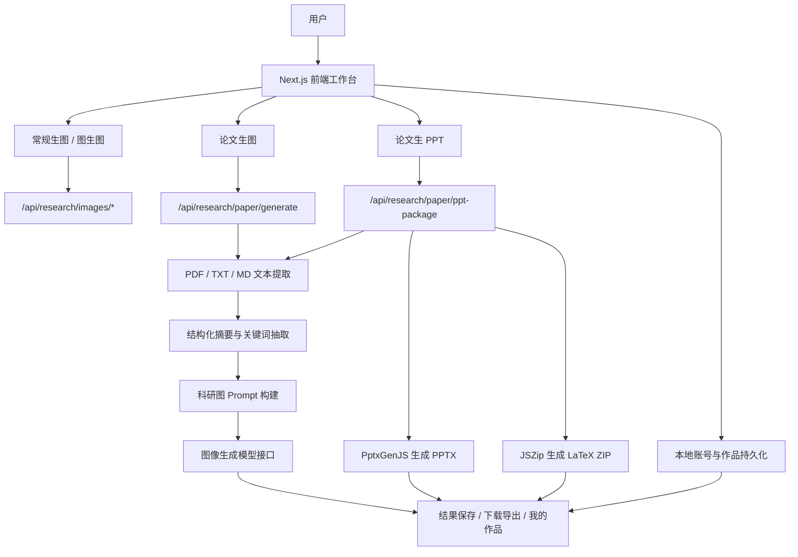
```mermaid
flowchart TD
    U["用户"] --> FE["Next.js 前端工作台"]
    FE --> G1["常规生图 / 图生图"]
    FE --> G2["论文生图"]
    FE --> G3["论文生 PPT"]

    G1 --> API1["/api/research/images/*"]
    G2 --> API2["/api/research/paper/generate"]
    G3 --> API3["/api/research/paper/ppt-package"]

    API2 --> PDF["PDF / TXT / MD 文本提取"]
    API3 --> PDF
    PDF --> SUM["结构化摘要与关键词抽取"]
    SUM --> PROMPT["科研图 Prompt 构建"]
    PROMPT --> IMG["图像生成模型接口"]

    API3 --> PPT["PptxGenJS 生成 PPTX"]
    API3 --> ZIP["JSZip 生成 LaTeX ZIP"]

    IMG --> SAVE["结果保存 / 下载导出 / 我的作品"]
    PPT --> SAVE
    ZIP --> SAVE
    FE --> STORE["本地账号与作品持久化"]
    STORE --> SAVE
```

该架构体现了 Paper Acc 的整体思路：前端工作台负责统一交互入口，服务端接口负责承接不同任务类型，论文解析模块负责把长文本转化为结构化摘要，Prompt 构建模块负责把研究内容映射为适合图像生成的任务描述，最终通过图像生成与文档导出引擎形成可下载、可保存、可复用的结果。这样的分层结构既保证了当前版本的可运行性，也为未来接入更强论文理解模型、账号系统和云存储能力预留了扩展空间。

### 3.4 交互流程

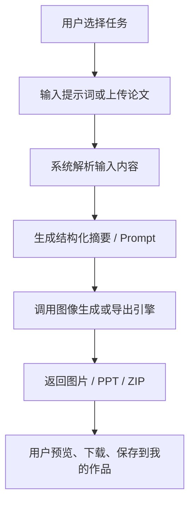
```mermaid
flowchart TD
    A["用户选择任务"] --> B["输入提示词或上传论文"]
    B --> C["系统解析输入内容"]
    C --> D["生成结构化摘要 / Prompt"]
    D --> E["调用图像生成或导出引擎"]
    E --> F["返回图片 / PPT / ZIP"]
    F --> G["用户预览、下载、保存到我的作品"]
```

从用户视角看，整个流程尽量被压缩为“选择任务 - 提供输入 - 获取结果 - 保存导出”四个核心动作。与传统做法相比，Paper Acc 并不要求用户在多个工具之间来回切换，也不要求其先手工提炼论文结构再逐步绘图，而是通过统一工作台把解析、生成、预览和导出整合在一个闭环里，从而降低认知负担和操作成本。

### 3.5 创新与差异化

1. **强场景聚焦是本产品最明显的差异化。** Paper Acc 没有把自己设计成一个泛化对话机器人，而是明确聚焦于科研表达环节，特别是论文配图与论文汇报生成。这种垂直聚焦使产品能够围绕一个明确人群持续打磨细节，也更容易在实际使用中形成稳定价值。

2. **一次上传，多种产出提高了同一份论文的复用效率。** 在传统流程中，用户往往需要分别为“画结构图”“画路线图”“做 PPT”准备不同资料和不同工具。而在 Paper Acc 中，同一份论文内容可以同时服务于总体框架图、技术路线图和汇报 PPT 的生成，这种复用机制显著提升了内容转化效率。

3. **学术表达导向让结果更贴近真实科研使用场景。** 论文生图不是简单调用图像接口，而是通过明确的学术 Prompt 模板，对结构、流程、模块标签、配色风格和图表元素进行约束。这种方式虽然不追求完全开放式生成，却换来了更强的稳定性和更高的学术适配度。

4. **可编辑导出能力增强了工具的实际落地价值。** 很多生成式工具停留在“生成一个看起来不错的结果”，而 Paper Acc 更强调结果是否可以继续使用。支持 `.pptx` 与 `.zip` 文件导出，意味着用户可以把生成内容真正带到组会、答辩和投稿流程中，而不是只停留在演示层面。

5. **从输入到留存的完整闭环提升了产品完成度。** 产品不仅提供生成能力，还提供预览、下载、账号会话与“我的作品”留存能力，使得结果能够持续积累和反复复用。这种闭环体验比单点能力更接近一个真正可运营、可迭代的产品原型。

## 四、作品界面展示

打开首页，可以了解产品的目标，对产品产生概览和了解。

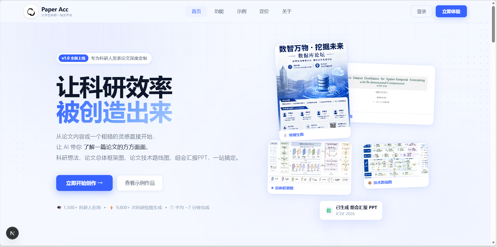

功能页面总体介绍了产品功能。

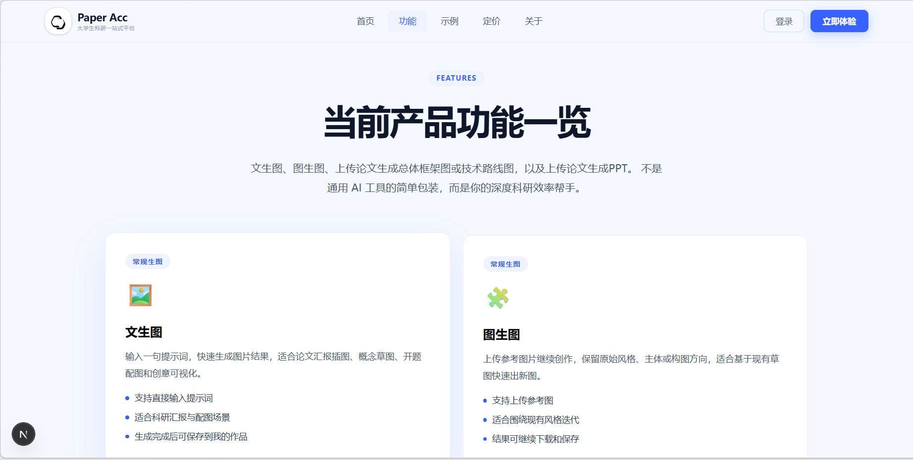

示例页面展示了一些使用本产品 AI 创作出的科研论文绘图、PPT 等。

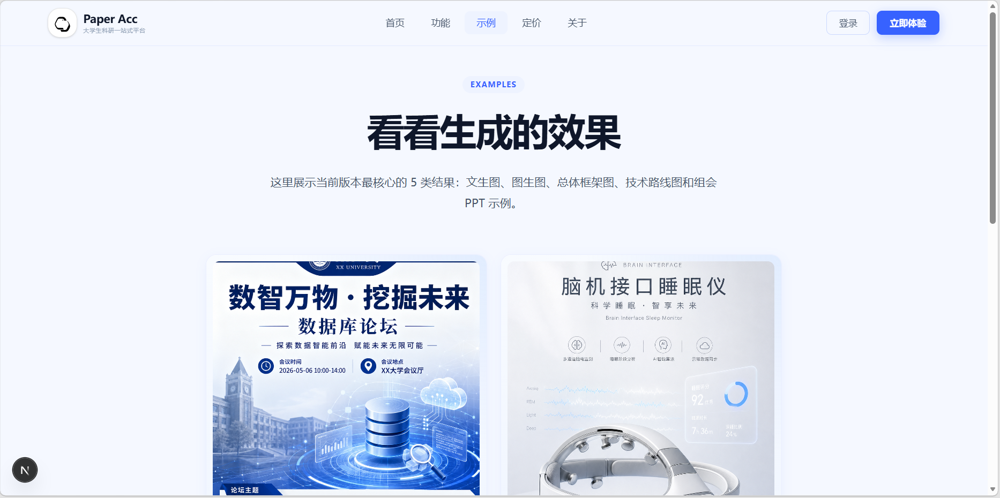

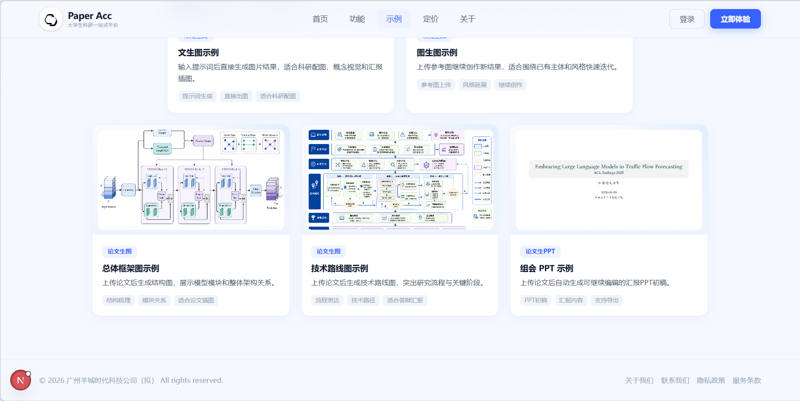定价页分成【免费体验】、【专业版】和【团队版】，给予不同的定价，对应产生不同的功能。

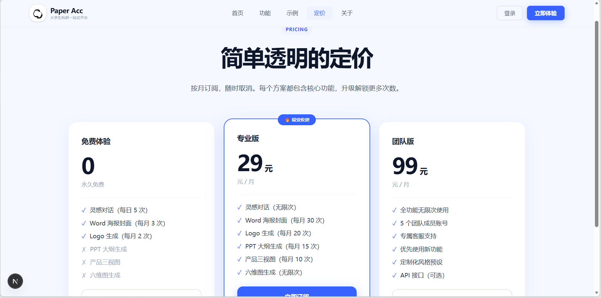

关于页面介绍一下产品的基本信息以及设计该产品的初衷。

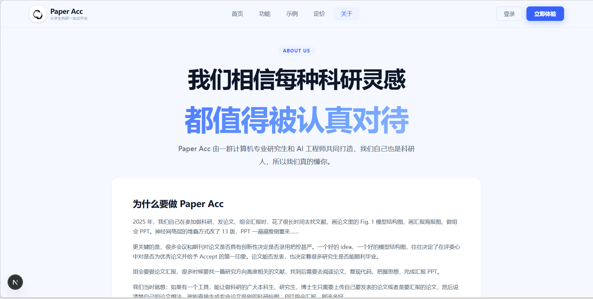

点击 `登录` 按钮后可以进行账号的注册和登录。

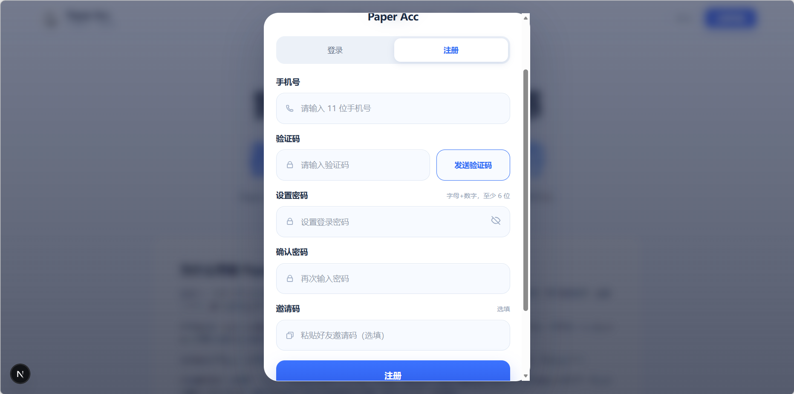

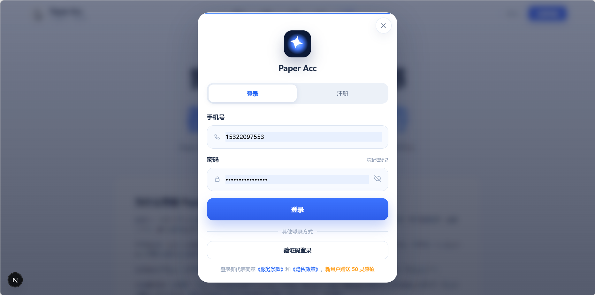

进入工作台，工作台上是所有创作工具和所有功能的总览。

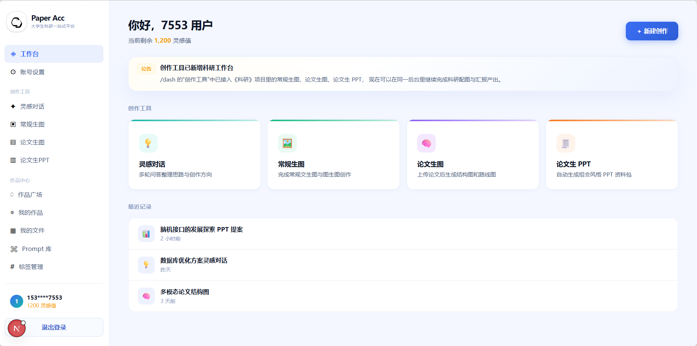

账号设置页面可以看到当前的灵感值，还可以充值（后续会通过**草料二维码**接入微信支付和支付宝支付），邀请好友注册账号也可以获得灵感值。

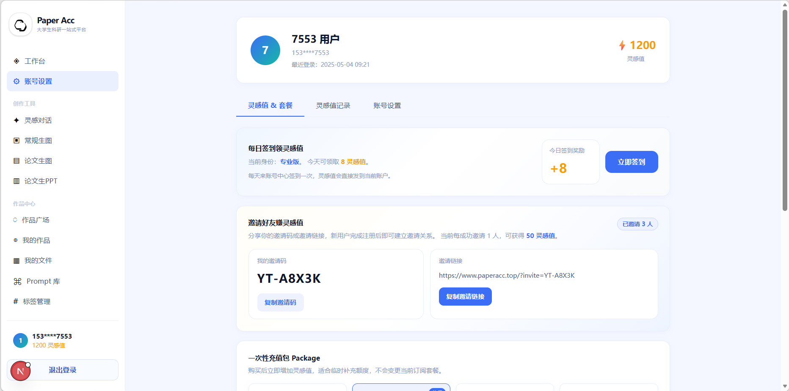

常规生图页面包括两个功能，分别是【文生图】和【图生图】。在文生图中输入提示词，点击 `生成图片`，等待约 7s 即可完成图片的生成。

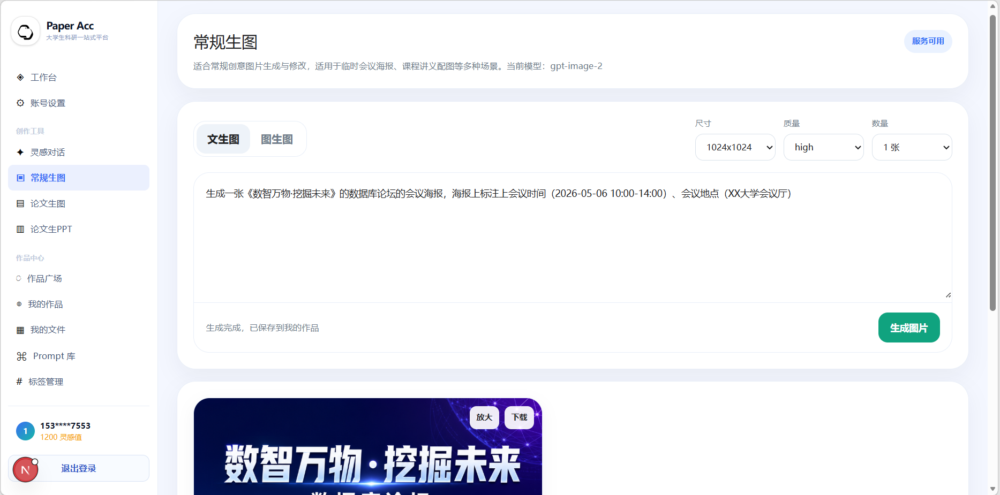

论文生图页面点击上传论文（可能是已经写好了即将发表的、缺了总体框架图的），选择 `总体框架图`，可选择补充附加要求，点击 `生成论文图`，等待后即可生成。

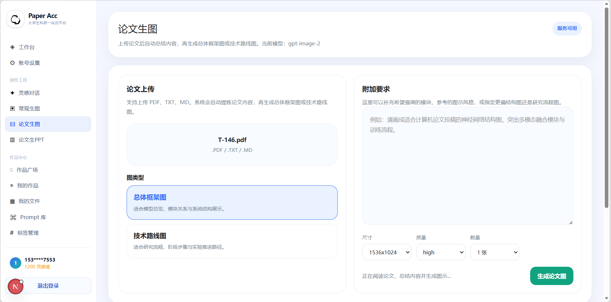

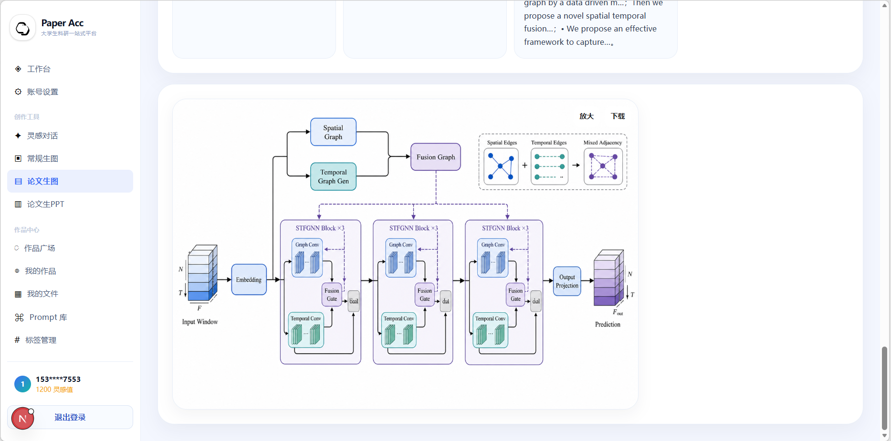

点击右上角的 `下载` 有两种下载格式，可以选择 `.png` 下载后不可修改，直接使用图片；也可下载成 `.svg`，下载后的图片是可编辑的结构化图片，可以编辑和修改图上的每一个形状和文字。

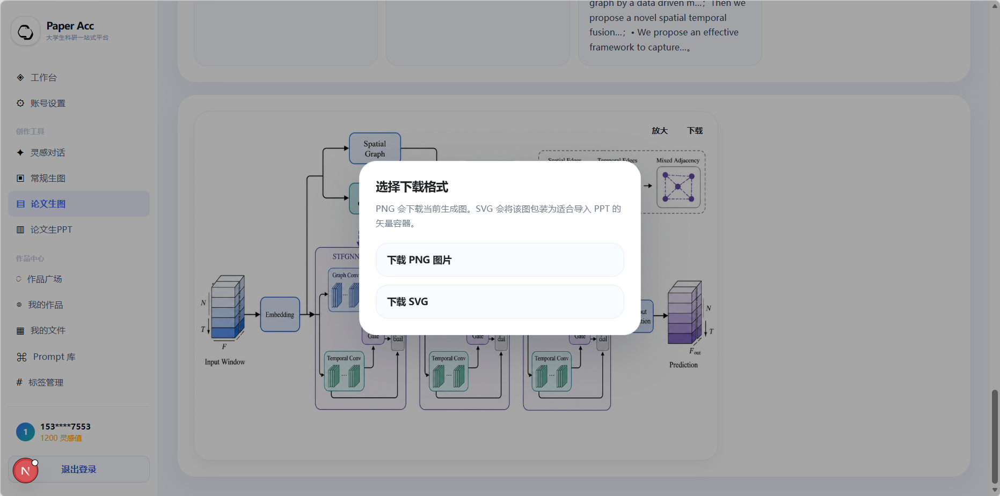

选择 `技术路线图`，可生成技术路线图。

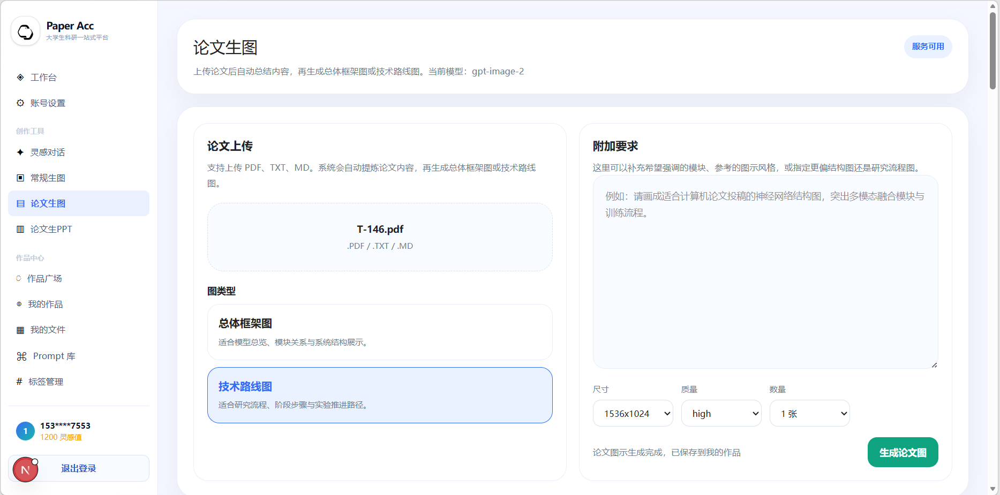

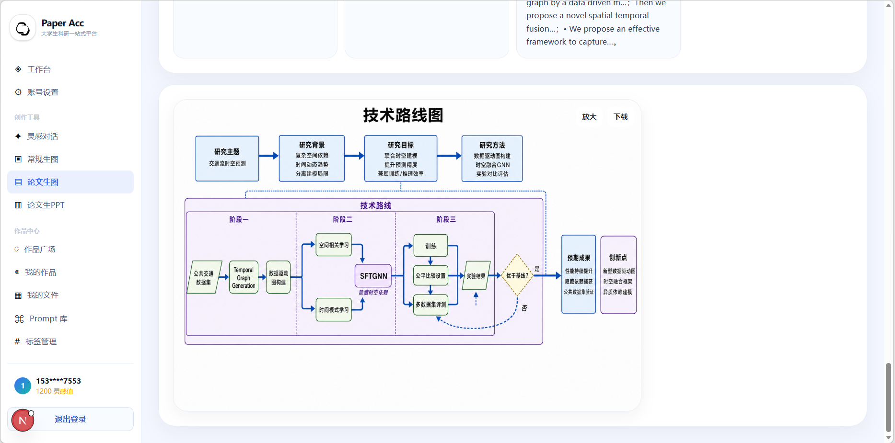

论文生 PPT 页面，上传论文，可选择补充附加要求，点击 `生成论文 PPT`，等待约 7s 即可完成 PPT 的自动生成。

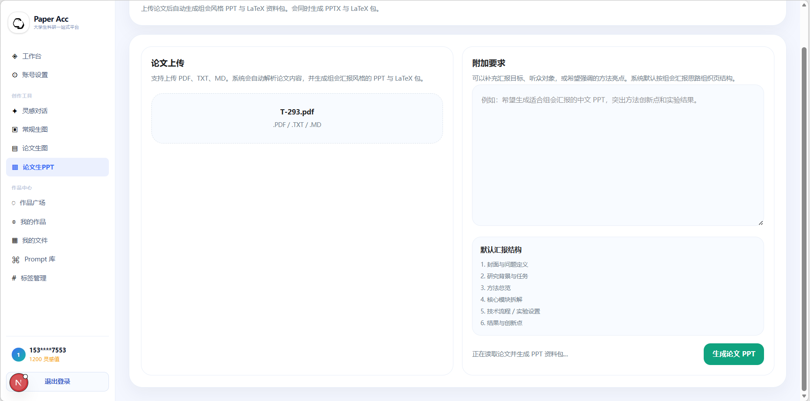

可选择下载的生成结果包括 `.pptx` 文件和 `.zip` 的Overleaf工程文件。

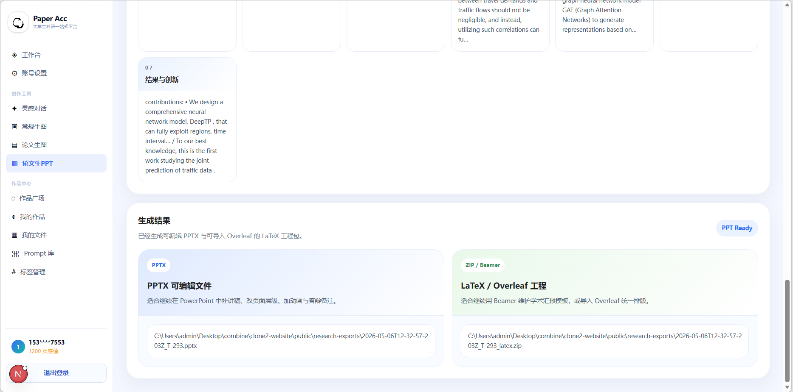

作品广场中集中展示使用本平台创作的各类优秀样例作品，包含文生图、图生图、总体框架图、技术路线图以及论文 PPT 等不同类型内容。

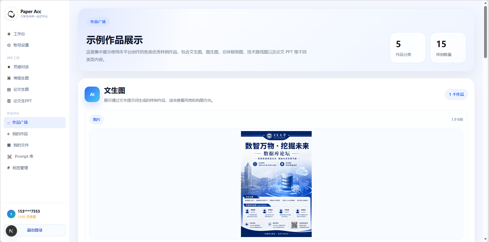

我的作品中记录所有的创作成果，且对每一个账号的创作记录都进行了**持久化**。

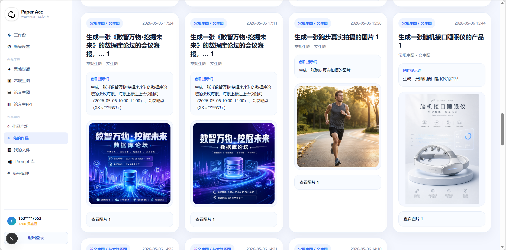

## 五、AI 原生能力说明

### 5.1 AI 核心能力

1. **文生图能力承担了科研视觉内容的快速生成任务。** 当用户只提供一句话描述时，系统可以直接生成与科研展示相关的配图、概念图或插图素材，帮助用户从抽象需求快速过渡到可用图像结果。这一能力在海报制作、汇报装饰、概念表达等轻量场景下具有很高的实用性。

2. **图生图能力增强了对既有素材的延展能力。** 很多科研用户并不是完全从零开始，他们可能已经有一张产品图、示意图或参考图，但希望进一步扩展风格、优化视觉表现或围绕同一主体生成更多版本。图生图功能能够让用户在已有素材基础上持续迭代，而不是反复从头描述。

3. **论文结构理解能力让系统具备初步“读论文”的能力。** 当前项目能够从 PDF、TXT、MD 文件中提取文本内容，并进一步抽取标题、研究问题、方法概述、输入输出、核心模块、流程步骤和创新点等信息。这种结构化处理虽然不是完整意义上的深度语义推理，但已经足以支撑科研图表生成和汇报初稿生成的核心需求。

4. **学术 Prompt 自动构建能力提高了生成结果的可控性。** 相比用户手工撰写提示词，系统可以根据不同任务类型自动拼装更规范、更稳定、更符合科研表达的指令内容。例如总体框架图更强调模块关系与输入输出，技术路线图更强调流程阶段、连接关系和视觉规范，这种差异化 Prompt 构造是结果稳定的重要原因。

5. **自动汇报材料生成能力把 AI 从“出图工具”扩展为“内容助手”。** 对于论文生 PPT 场景，AI 不再只负责一张图，而是参与了整套汇报材料的结构化生成。系统会围绕论文核心内容组织页面逻辑，让用户获得一个具备讲述顺序的初稿，从而把 AI 的价值从局部生成扩展到完整内容组织。

### 5.2 AI 如何解决痛点

Paper Acc 对科研用户最关键的价值，不是替代研究本身，而是缩短“研究成果表达”的时间，并降低科研成果从文本到作品的转换门槛。

1. **针对“不会画图”的痛点，AI 把论文结构直接转化为视觉表达。** 用户不需要自己决定每个框怎么画、每条箭头怎么连，也不需要先学会复杂设计软件，而是可以先获得一个结构合理、具备学术风格的初始结果，再基于此进行微调，从而把最难的第一步自动完成。

2. **针对“没时间做 PPT”的痛点，AI 自动完成初稿搭建。** 系统能够根据论文内容生成标题页、研究问题、方法概述、流程步骤、结果与创新点等基础页面，帮助用户快速搭起一个可以讲的框架。这样一来，用户后续只需做有针对性的修改，而不需要从空白页面开始反复梳理逻辑。

3. **针对“通用工具不稳定”的痛点，AI 通过场景化约束提升可控性。** Paper Acc 并不是直接把论文文本原样送入图像生成接口，而是先通过结构化抽取和模板化 Prompt 把任务收敛，再向模型发起请求。这种“先规整、再生成”的方式减少了随机性，让结果更接近科研用户真正需要的表达形式。

4. **针对“成果难复用”的痛点，AI 结果被纳入完整导出与留存链路。** 生成结果不是一次性展示页，而是可以下载、保存、再次查看、继续编辑的可交付产物。特别是在 PPT 和 LaTeX 包导出方面，这种设计显著提高了 AI 成果进入真实科研工作流的可能性。

如果去掉 AI，项目仍然可以保留“论文上传 + 模板导出”的基础能力，但将失去科研图像生成这一最有辨识度的核心价值，整体效率提升也会明显下降。因此，AI 在本项目中不是表层包装，而是驱动产品成立的关键引擎。

### 5.3 AI 技术方案

1. **前端交互层基于 Next.js 16 与 React 19 构建统一工作台。** 用户可以在同一套界面中完成常规生图、图生图、论文生图和论文生 PPT 等操作。这样的统一入口降低了任务切换成本，也让产品更像完整工作台，而非一组分散的能力集合。

2. **输入理解层负责把上传论文转化为可处理文本。** 系统使用 `pdfjs` 对 PDF 文件做文本提取，同时支持 TXT 和 MD 文件的直接解析。这样设计的好处在于，它兼顾了科研场景中最常见的论文输入格式，也让后续摘要抽取与导出链路能够共用一套解析基础。

3. **结构化抽取层负责从长文本中提炼可生成信息。** 项目当前主要采用本地规则方法，对论文中的研究问题、方法概述、核心模块、流程步骤、输出结果和创新点进行抽取与压缩。虽然这不是一个复杂的大模型阅读系统，但它足够轻量、可控，也更适合作为原型阶段的稳定实现。

4. **Prompt 构建层负责把论文内容映射为不同任务的生成指令。** 对于总体框架图和技术路线图，系统会根据任务差异自动拼装不同的学术 Prompt，并将生成后的提示词保存到 `public/research-prompts/` 目录中。这个过程不仅提升了结果稳定性，也让生成链路具备一定的可追溯性和可复用性。

5. **生成层负责调用图像接口完成最终图像输出。** 当前项目默认使用 `gpt-image-2` 作为图像模型，通过服务端 API 将规范化后的请求发送到图像生成接口。对用户来说，这一层隐藏在系统后端，但它承担了从结构化信息到视觉结果的关键转换任务。

6. **导出层负责把结构化内容转成可编辑交付物。** 项目使用 `PptxGenJS` 生成 `.pptx` 文件，使用 `JSZip` 生成配套的 LaTeX `.zip` 文件包，并统一输出到 `public/research-exports/` 目录。这样设计意味着用户不仅能看结果，还能把结果带走、继续改、继续讲。

7. **持久化层负责实现轻量级作品留存。** 系统通过本地存储保存当前账号会话和“我的作品”记录，让生成结果具备基础留存能力。虽然当前版本还不是完整云端账户系统，但作为原型，它已经完成了从创作到归档的基本闭环。

## 六、后续商业计划

### 6.1 落地可行性

1. **项目链路已经完整打通，具备原型级落地基础。** 当前版本并不是停留在页面设计或概念演示，而是已经具备页面、接口、论文解析、图像生成、PPT 导出、作品保存等完整模块。这意味着它不仅可以展示“想法是什么”，还能够证明“这个想法已经可以跑起来”。

2. **本地 Demo 已具备可演示条件。** 结合当前项目状态，`http://localhost:3000/` 已可以正常访问，并返回有效页面结果。这一点对于参赛展示非常重要，因为它说明项目并非停留在文档层面，而是具备直接操作、直接演示、直接验证的能力。

3. **技术选型务实，适合继续迭代。** 前端采用 Next.js，服务端接口与页面共仓管理，论文解析使用 `pdfjs`，PPT 导出使用 `PptxGenJS`，压缩打包使用 `JSZip`。这些技术都相对成熟，接入成本较低，能够支持项目在原型阶段快速迭代，也便于后续扩展数据库、云存储和正式账户系统。

4. **产品结构清晰，具备向正式产品演进的空间。** 当前项目已经形成较明确的模块分工和交互闭环，未来可以进一步接入更强的论文理解模型、多人协作、云端作品管理、模板市场和团队空间等能力。因此，Paper Acc 并不是一个一次性演示工具，而是具备持续产品化潜力的原型。

### 6.2 商业化思考

1. **订阅模式具备初步雏形。** 从现有页面设计可以看到，产品已经规划了免费版、专业版和团队版等不同档位。这说明项目在原型阶段就已经开始考虑不同用户层级的需求差异，而不是只关注技术功能本身。

2. **域名已注册，公司已拟定成立**：本产品初步判定在研究生博士生等科研学生领域有巨大的蓝海，每位用户注册的时候会有免费的灵感值额度，免费的灵感值可以体验完产品所有的功能；产品每天签到会自动增加灵感值，便于增加用户粘性；当用户的灵感值用完需要通过**微信支付或支付宝支付**增加灵感值。

3. **点数体系有助于建立可运营的资源管理机制。** 项目中设计了“灵感值”这一生成额度概念，并配套签到、邀请、充值包等机制。这种方式既便于控制生成成本，也有助于形成轻量级增长体系，使产品从单次使用工具逐步转向可持续运营的服务形态。

4. **团队场景为后续商业转化提供了更高客单价可能。** 对于实验室、课题组、科研团队而言，他们往往需要多人使用、统一管理、快速交付和更稳定的服务体验。如果未来接入正式账号体系、共享空间与 API 能力，团队版将具备面向实验室或高校科研团队收费的现实基础。

5. **B 端和教育端扩展空间较大。** Paper Acc 的目标场景并不局限于个人用户，还可以进一步延伸到高校课程展示、科研训练营、学术培训平台、大学生竞赛辅导以及科研服务平台等场景。尤其是在“论文内容快速转化为展示物料”这一环节，其实具备天然的教育与服务属性，因此具有一定的市场延展性。

## 七、作品价值与展望

### 7.1 完整性

1. **问题定义清晰，价值场景明确。** 本项目聚焦科研用户在“研究完成之后如何高效表达”的真实痛点，并不是泛泛讨论 AI 能做什么，而是精准切入论文配图、路线图生成与 PPT 汇报等高频需求场景，因此问题与价值之间的关系非常直接。

2. **AI 在产品中发挥了关键作用。** AI 不只是一个点缀式功能，而是贯穿于图像生成、论文内容结构化、Prompt 构建和汇报材料输出等核心流程中。也就是说，没有 AI，项目就很难形成当前这种效率提升效果，AI 对产品成立具有决定性作用。

3. **流程完整闭环，具备实际使用逻辑。** 从上传论文或输入提示词，到生成图片、生成 PPT、导出下载，再到“我的作品”留存，项目已经打通了一个完整链路。这使得它不是一个单点能力展示，而是一个真正具备使用闭环的原型产品。

4. **Demo 可运行，展示可信度较高。** 当前本地 Demo 已部署到公网且可以访问，这意味着评审不只能看方案描述，还能看到系统的真实运行效果。

5. **实际价值明确，效率提升可感知。** Paper Acc 的核心价值在于减少科研绘图和汇报制作的重复劳动，把原本需要数小时甚至数天完成的表达性工作压缩到更短时间内完成。这种效率收益对学生、研究者和课题组都有直接吸引力。

### 7.2 创新性

1. **场景创新体现在“科研表达工作台”的整体定位上。** 市面上不缺通用 AI 工具，但同时覆盖论文配图、技术路线图、框架图和 PPT 汇报生成的科研垂直工具并不多。Paper Acc 的创新之处，就在于把这些原本分散的需求整合为一套统一工作台。

2. **方案创新体现在“规则摘要 + 生成模型 + 可编辑导出”的组合路径上。** 它并没有盲目追求完全端到端的大模型黑盒输出，而是采用结构化抽取与模板化约束来提升稳定性，再把生成能力用在最适合的环节上。这种组合方式兼顾了工程可控性和 AI 创新性。

3. **差异化优势体现在更懂科研表达而非更会聊天。** 项目并不是与通用模型比拼开放式问答能力，而是围绕科研图表规范、汇报逻辑、学术输出格式做专项优化。这种“更懂任务”的差异化，往往比“功能更多”更有竞争力。

4. **具备复用与推广潜力。** 不同学校、实验室、课程和竞赛团队都存在类似需求，因此项目并不是只适合一个狭窄场景。只要围绕科研表达持续打磨，它就有机会从个人工具进一步扩展为教育场景和科研团队场景中的通用效率产品。

### 7.3 技术实现性

1. **AI 技术使用有一定深度，而非只停留在简单调用接口。** 项目除了图像生成本身，还涉及论文文本提取、结构化摘要抽取、任务化 Prompt 构建、PPT 内容组装和多格式导出等流程，说明它已经具备一定程度的系统化 AI 工程思维。

2. **技术架构分层清晰，职责明确。** 前端、接口、论文解析、图像生成、PPT 导出、结果留存等模块分工比较清楚，整体结构可读性强，也有利于后续维护与功能迭代。这说明项目在原型阶段已经具备较好的工程组织意识。

3. **工程上具备可验证性和可运行性。** 当前项目存在明确的页面入口、可访问的 API 路由、实际的导出目录以及已生成的样例产物，这些都使得它不只是概念方案，而是可以被直接测试和验证的系统原型。

4. **稳定性与扩展性之间做了平衡。** 当前版本没有依赖复杂的后端基础设施，却已经完成了端到端体验；同时其分层结构又为未来接入更强模型、正式持久化服务和云端能力留出了空间。因此，从原型角度看，它在实现成本与扩展潜力之间取得了较合理的平衡。

## 八、总结

Paper Acc 不是一个泛化的 AI 聊天工具，而是一个面向科研表达环节的垂直 AI 创作平台。它围绕“论文内容如何更快变成作品”这一核心问题，打通了科研图片生成、论文框架图生成、技术路线图生成与汇报 PPT 导出等关键链路。对于参赛展示而言，这个项目的优势在于痛点明确、场景真实、流程完整、Demo 可运行，并且已经具备一定产品化与商业化思路。未来如果继续补强论文理解能力、账号体系和云端协作能力，Paper Acc 有机会从一个高完成度原型进一步成长为真正服务科研用户的实用型 AI 产品。
